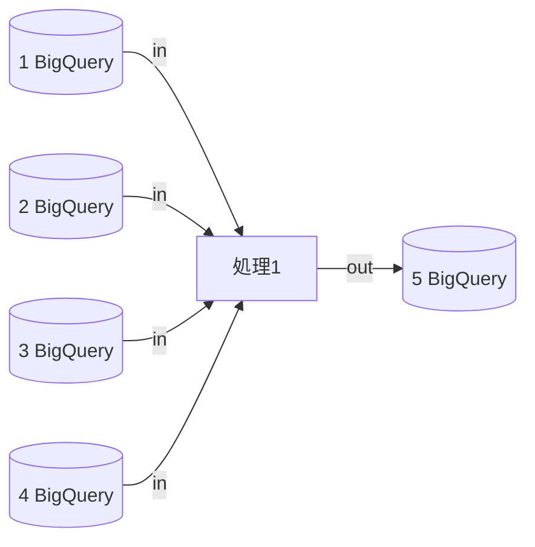
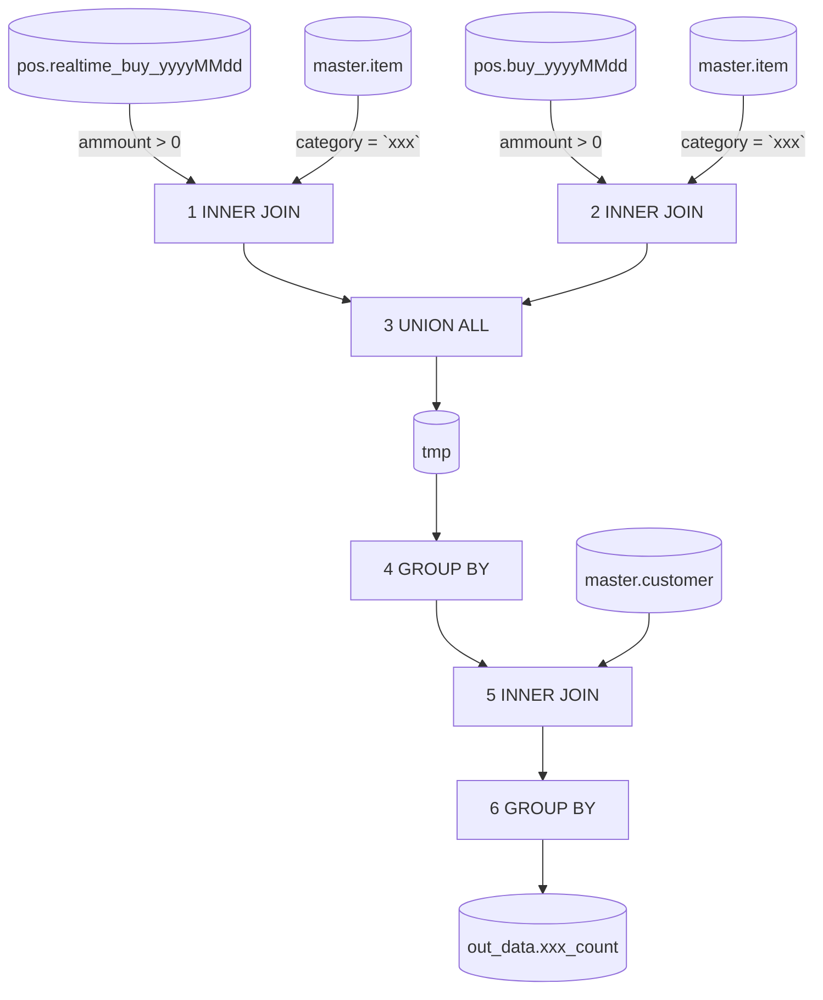

- 更新履歴
    1. 新規作成
        1. December 1, 2022
        2. @Taro Yamada
    2. 〇〇機能追加に伴う、詳細設計の修正
        1. December 2, 2022
        2. @Taro Yamada

# (Title)設計書 〇〇クエリ

---

## 1.機能概要

本機能は顧客ランクごとに○○カテゴリ商品が購買された数を抽出するクエリである

## 2.処理フロー

### 2.1.DF図



### 2.2.テーブル一覧

| # | 論理名 | 物理名 | 備考 |
| --- | --- | --- | --- |
| 1 | 最新購買データ | pos.realtime_buy_{yyyyMMdd} | 当日のデータを使用 |
| 2 | 過去購買データ | pos.buy_{yyyyMMdd} | 1日前から30日前のデータを使用 |
| 3 | 商品マスタ | master.item | - |
| 4 | 顧客マスタ | master.customer | - |
| 5 | 〇〇販売量 | out_data.xxx_count | - |

### 2.3.関数一覧

| # | 関数名 | 引数 | 戻り値 | 備考 |
| --- | --- | --- | --- | --- |
| 1 | date_days_ago | 数値 | 現在日を基準とした[数値]日前の日にち | - |

### 2.4.処理一覧

| # | 処理名 | 詳細 | 処理順序 |
| --- | --- | --- | --- |
| 1 | 顧客ランクごと○○カテゴリ商品購買数算出 | 顧客ランクごとに○○カテゴリ商品が購買された数を取得する | 1 |

# 処理1詳細

---



| # | 処理名 | 処理内容 | 条件 | 処理後カラム | 備考 |
| --- | --- | --- | --- | --- | --- |
| 1 | INNER JOIN | 内部結合 | 商品IDが一致しているものを結合<br>抽出条件<br>ammount > 0 and <br>item.group = 'XXX’ | pos_id<br>customer_id<br>timestamp<br>ammount<br>count | ```date_days_ago```を使用する |
| 2 | INNER JOIN | 内部結合 | 商品IDが一致しているものを結合<br>抽出条件<br>ammount > 0 and <br>item.group = 'XXX’ | pos_id<br>customer_id<br>timestamp<br>ammount<br>count | ```date_days_ago```を使用する |
| 3 | UNION ALL | 縦結合 | - | pos_id<br>customer_id<br>timestamp<br>ammount<br>count | - |
| 4 | GROUP BY | customer_idごとに集計 | タイムスタンプの最大値を算出<br>amountの合計を算出<br>countの合計を算出 | customer_id<br>timestamp<br>ammount<br>count | - |
| 5 | INNER JOIN | 内部結合 | customer_id = master.customer_id | customer_id<br>customer_rank<br>timestamp<br>ammount<br>count | - |
| 6 | GROUP BY | customer_rankごとに集計 | タイムスタンプの最大値を算出<br>amountの合計を算出<br>countの合計を算出 | customer_rank<br>timestamp<br>ammount<br>count | - |